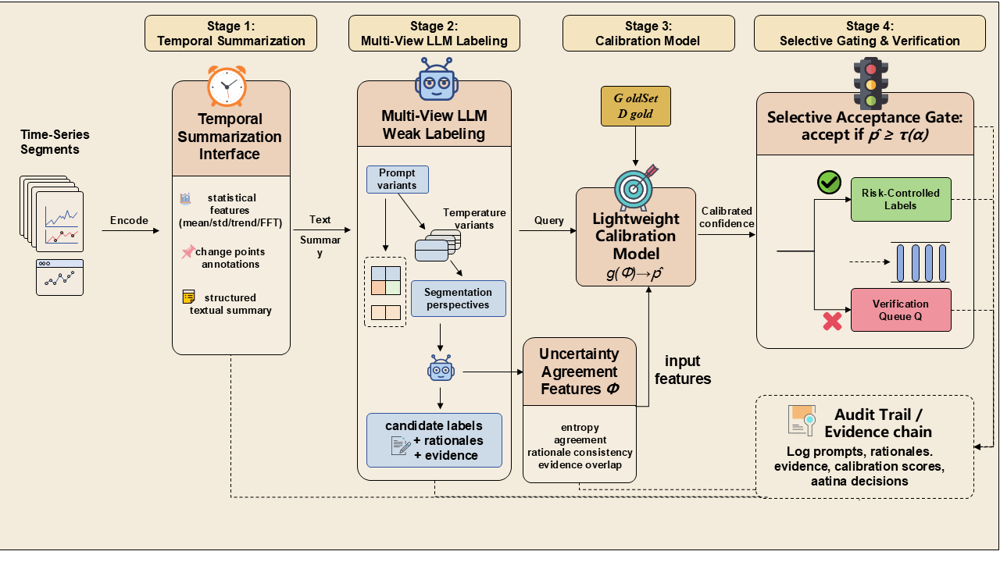

# CALM-TS: Risk-Controlled LLM Labeling for Time-Series via Calibrated Selective Gating

[](https://doi.org/10.5281/zenodo.20506015)

> **What this repository contains.** This public repository hosts the **CALM-TS framework source** (`experiments/lib/`), the data-preprocessing scripts, and a small **CPU demo**. The complete artifact — all experiment runners, the figure-generation pipeline, the per-seed run artefacts (10 methods × 5 seeds), and the LLM prompt–response audit logs — is archived in the **Zenodo deposit ([10.5281/zenodo.20506015](https://doi.org/10.5281/zenodo.20506015))** cited in the paper. Use the Zenodo deposit to reproduce the paper's tables and figures.

## Abstract

Labeling time-series events such as anomalies and system failures remains
expensive and subjective, while distribution drift causes label definitions to
evolve over time. Large language models (LLMs) offer a promising avenue for
generating weak labels with natural language explanations, yet their outputs
suffer from uncontrolled error rates and opaque failure modes.

**CALM-TS** is a risk-controlled weak supervision pipeline that leverages a
small gold-labeled calibration set to bound the labeling error rate while
maximizing coverage. The approach combines multi-view LLM weak labeling with a
lightweight calibration model and a selective acceptance gate, ensuring that
automatically accepted labels satisfy a user-specified risk threshold α.

## Pipeline Overview



*Figure 1.* CALM-TS converts time-series segments into structured textual
summaries (Stage 1), queries an LLM with diverse prompts, temperatures, and
context windows to elicit multi-view labels with rationales (Stage 2), learns
a lightweight calibrator over disagreement features on a small gold set
(Stage 3), and selectively gates accepted labels under a finite-sample risk
budget while routing uncertain instances to cost-aware verification (Stage 4).

## Quick Start (framework + CPU demo)

### Environment

Python 3.11 + the deps in [requirements.txt](requirements.txt):

```bash
python3 -m venv .venv && source .venv/bin/activate
pip install -r requirements.txt
```

### Dataset access

The demo uses the **PhysioNet Challenge 2015** benchmark (open data). See
[DATA.html](DATA.html) for full credentialing / download instructions across
all three benchmarks; summary:

| Dataset | Source | Access |
|---|---|---|
| MIMIC-III v1.4 | https://physionet.org/content/mimiciii/1.4/ | PhysioNet credentialed (CITI training + DUA) |
| PhysioNet Challenge 2015 | https://physionet.org/content/challenge-2015/1.0.0/ | open data, anonymous download |
| Yahoo S5 | Webscope (decommissioned by Verizon) / Aliyun Tianchi mirror | see DATA.html for current mirror notes |

Download the raw data and run the corresponding `experiments/preprocess_*.py`
to produce `windows.npy`, `labels.npy`, `split.json` under `$CALM_TS_DATA/`.
The expected layout and shape contracts are in [DATA.html](DATA.html).

### Configuration

```bash
export CALM_TS_DATA=/path/to/processed/data    # contains physionet/, mimic/, yahoo/
export OPENAI_API_KEY=sk-...                   # OpenAI-compatible chat model
export OPENAI_BASE_URL=https://...             # optional, e.g. for self-hosted gateways
export MODEL=gpt-4o-mini                       # any OpenAI-compatible chat model id
```

### Run the demo

```bash
python experiments/runbook/demo_run.py   # subsampled single-seed demo on PhysioNet
```

The demo exercises the full framework end-to-end (temporal summarization →
multi-view LLM labeling → calibration → selective gating) on a small subsample.
It requires `$CALM_TS_DATA/physionet` (see above) and an OpenAI-compatible API
key. It is a pipeline demonstration, not a reproduction of the paper's numbers.

## Key Results

Camera-ready Table 1 (α = 0.05) CALM-TS operating points (MIMIC-III and
Yahoo S5: 5 random gold splits with GPT-4; PhysioNet: 5 seeds on the official
Challenge 2015 binary alarm-verification task with gpt-4o-mini):

| Dataset | Risk | Coverage | Normalized Cost | F1 |
|---|---|---|---|---|
| MIMIC-III | 0.048 ± 0.002 | 0.82 | 0.23 | 0.891 |
| PhysioNet | 0.340 ± 0.010 | 0.286 ± 0.008 | 1.59 | 0.375 |
| Yahoo S5 | 0.044 ± 0.003 | 0.85 | 0.19 | 0.902 |

CALM-TS is the only method meeting α = 0.05 on all 10 MIMIC-III / Yahoo S5 seed
pairs, and the only method whose mean risk on PhysioNet falls below the
unfiltered LLM (0.400 → 0.340, 15.0% relative reduction at coverage 0.286),
against nine LLM-as-weak-labeler baselines.

**Reproducing the tables/figures.** The full experiment runners, per-seed run
artefacts (`cells/`, `manifest.json`, `raw_trace.jsonl.gz` audit logs), and the
figure-generation pipeline are in the Zenodo deposit
([10.5281/zenodo.20506015](https://doi.org/10.5281/zenodo.20506015)).

## Citing

```
@software{calm_ts_2026,
  title  = {CALM-TS: Risk-Controlled LLM Labeling for Time-Series via Calibrated Selective Gating},
  year   = {2026},
  doi    = {10.5281/zenodo.20506015},
  url    = {https://doi.org/10.5281/zenodo.20506015},
}
```

## License

MIT License. See [LICENSE](LICENSE) for details.
